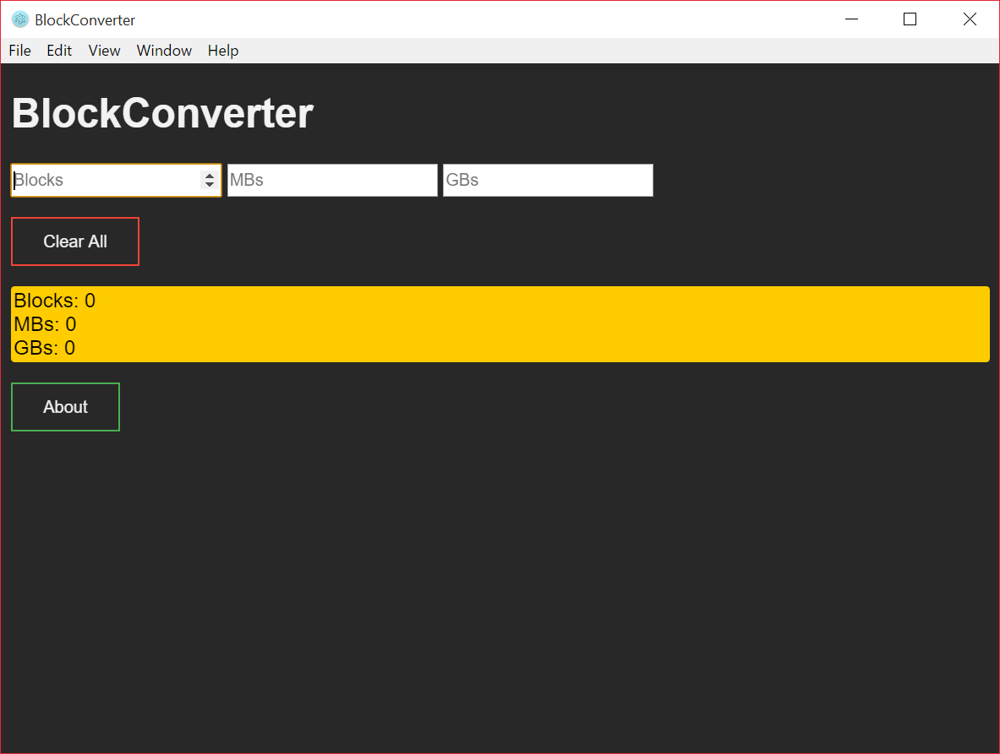

# BlockConverter

**A simple Nintendo Block to MB/GB converter.**

This is a minimal Electron application based on the [BlockConverter-Ruby](https://github.com/Samplasion/BlockConverter-Ruby) Ruby gem.

> This app contains a Dark Mode. To use it, go to the app's directory, then go to `resources\app\` and edit the `index.html` file to link to the `style-dark.css` stylesheet rather than `style.css`.

[](tryit.html)
> BlockConverter in its Dark Mode

## How To Use

To clone and test this software, you'll need **[Git](https://git-scm.com)**, **[Node.js](https://nodejs.org/en/download/)** (which comes with **[npm](http://npmjs.com)**) and **[electron-packager](https://github.com/electron-userland/electron-packager)** installed on your computer. From your command line:

```bash
# Clone this repository
git clone https://github.com/samplasion/blockconverter
# Go into the repository
cd blockconverter
# Install dependencies
npm install
# Run the app
npm start
```

Alternatively, you can build and run this software, by doing:

```bash
# Clone this repository
git clone https://github.com/samplasion/blockconverter
# Go into the repository
cd blockconverter
# Install dependencies
npm install
# Build the app
electron-packager .
```

You'll find the software in `blockconverter-out`.This is particularly useful, as it builds an `.exe` ready to use.

Finally, there's a prebuilt `.exe` **[here](http://www.mediafire.com/file/s9w0jy1m22bg8uv/blockconverter-win32-x64.rar)**.

## License

[CC0 1.0 (Public Domain)](LICENSE.md)

## Contributing

You can contribute by translating this project. Just create a branch called as your language code [ex.: Italian -> it] and send a pull request. You can also improve others' translations.

## Credits

All the contents of this application were made by Samplasion.
